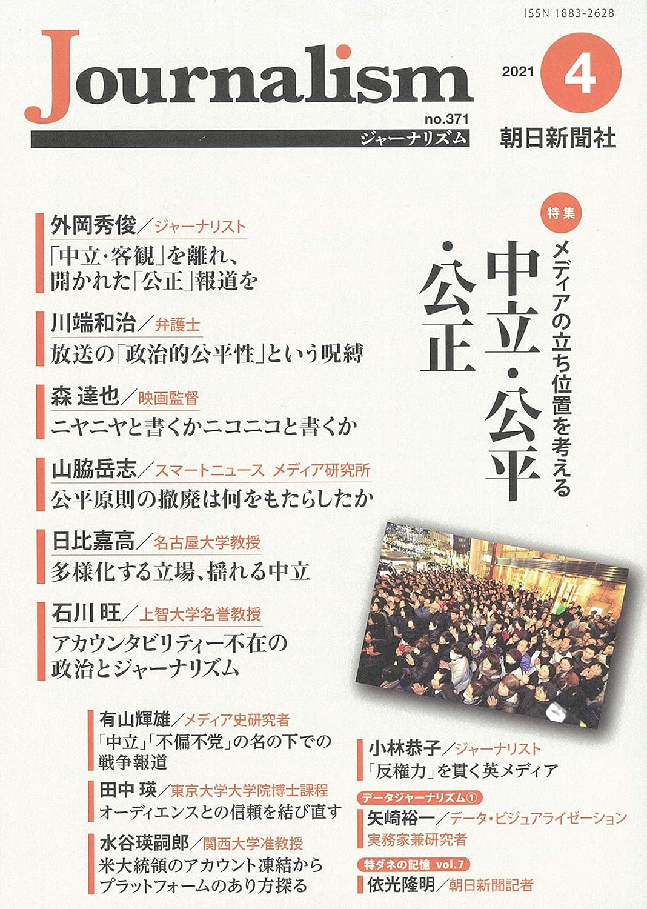

+++
author = "Yuichi Yazaki"
title = "データジャーナリズム　その１　定義と歴史を概観する"
slug = "asahi-journalism-2021-1"
date = "2021-04-09"
description = ""
categories = [
    "data-journalism"
]
tags = [
    "",
]
image = "images/asahi-journalism-2021-1.jpg"
+++

※本記事は朝日新聞社ジャーナリスト学校による「Journalism(ジャーナリズム)  2021年4月号」に掲載された著者自身による記事の転載です。
Journalismは残念ながら現在休刊中ですが、[Amazonなどでバックナンバーを入手することができます](https://amzn.to/41hsASj)ので、機会があればぜひお手にとってください。

# データジャーナリズム　その１　定義と歴史を概観する

## 始まりは1800年代にあり。現在の世界的潮流は?

　ここ数年来、注目されている取材手法に「データジャーナリズム」がある。政府や企業などが公開する大量の情報を分析し、新しい事実や埋もれていた社会課題を掘り起こす調査報道のことだ。ＩＴ技術の発達のおかげで身近になってきたが、一般の記者にとってはまだ遠い存在であるともいえる。当欄「記者講座」では今回から全４回の予定で、その定義や歴史、具体的な手法や実践例を紹介する。

<!--more-->

　誰しもが東京オリンピック・パラリンピックの開催を迎えると信じて疑わなかった２０２０年が、年明け早々からＣＯＶＩＤ―19（新型コロナウイルス感染症）への恐怖に包まれ、大多数の国民の関心事となった。データジャーナリズムに取り組む報道機関やジャーナリストはこれまで限定的だったが、このコロナ禍により突如、中央・地方にかかわらず取り組まざるをえない状況が現出したといえる。とはいえ、報道において連日陽性者や重症者数をチャートやダッシュボード（様々な情報をまとめて一覧表示したもの）にして取り上げればそれでよいのか。ほかにできることはないのか。本稿では、海外を含めたデータジャーナリズムの定義と歴史をマクロに概観して提示する。

## データジャーナリズムとは何か

　定義はさまざまだが、おおむね「従来のジャーナリズム手法に加えて、データ分析、プログラミング、ストーリーの視覚化などの技術が採用されている現代ジャーナリズムの一側面である」（DataJournalism in Sweden）と 捉 え る こ とができる。その上でここでは以下の三つの観点から詳細にふれていく。

### １ 調査報道の一形態として

　データジャーナリズムを調査報道の一形態として捉えると理解が進む。調査報道とデータジャーナリズムをほぼ同義と捉える見解もあれば、「ワシントン・ポストがウォーターゲート事件で見せたような手法とはまったく対照的な調査報道」として、調査報道の中でも従来の手法 を ハ イ リ ス ク・ ハ イ リ タ ー ン 手 法、「データ集約型」をローリスク・ローリターン手法として明確に区別する見解もあるが、これはデータジャーナリズムをやや狭義に捉えているため、本稿では従来の手法と対照的には捉えず、その一形態として捉えることとする。

　まずは調査報道の定義を『調査報道実践マニュアル』（マーク・リー・ハンター編著、旬報社）から一部引用する。

　「通常のニュース報道は、世界をありのままに、客観的なイメージを作り出すことを目的としている。調査報道では、世界を改善するという主観的な目的に向かって、客観的に見て本当の材料、すなわち分別のある観察者が真実だと認めるような事実を使用する」

　そのためにまずは仮説を立てるわけだが、例えば政府や企業などの公的な組織の公式見解（表向き言っていること）と実際に行っていることが異なると考えた場合、これ自体が仮説となる。

　そしてその仮説を実証し、公式見解を覆すためにはできるだけ根源的な情報にアクセスし、そこから「真実だと認めるような事実」を入手する必要がある。そのため公開情報はもちろん、リークを含む未公開情報や人的情報源にアクセスし、物的証拠や状況証拠を突き止める。その際の証拠となる資料は、広く捉えればデータであるといえるし、資料を手動で扱うのみならずコンピューターを用いればデータジャーナリズムと言えるだろう。

### ２ プロセスとプレゼンテーション

　さらにデータジャーナリズムの特徴をいえば、報道におけるプロセス（仮説・取材・資料の分析）とプレゼンテーション（コンテンツとして世の中へ提示）の双方を指すことが多くの研究によって強調されている。

　プロセスにおいては、データの収集や分析にコンピューターを用いることを指す。世界にあふれるデータ量は年々増加している。たとえばパナマ文書の際はリークした文書の容量が２・６テラバイト、１１５０万ファイルほど存在した。これら大量のファイルの中から告発に値する事実を発見するのは人力のみでは不可能に近かった。

　プレゼンテーションにおいては、一義的には、インターネット端末を閲覧対象とした際の提示方法として、インタラクティブ（双方向）なコンテンツやＶＲ（仮想現実）・ＡＲ（拡張現実）などのアプリ、もしくは映像などのコンテンツデリバリーを指すが、デジタルファーストで制作したコンテンツは、静止画として紙面への展開にも融通が利くため、たとえばニューヨーク・タイムズや日経新聞などではデジタルと紙面の両方で、同一データ同一コンテンツから切り口を変えて同時期にコンテンツを展開する事例もある。

　プロセスとプレゼンテーションは、どちらか一方のみでもコンピューターを用いてデータを扱っていればデータジャーナリズムと呼べる。すなわちプロセスにおいてコンピューターによるデータ分析を行い、プレゼンテーションとして通常の報道のようにテキストによる記事コンテンツとする場合でも、プロセスは通常の報道と同様であってもプレゼンテーションにおいてコンピューターを用いてデータを扱っていればデータジャーナリズムと呼べる。

　朝日新聞「データジャーナリズム事例集」による分類をひもとけば、プロセスとはデータベース重視・データ分析重視であり、プレゼンテーションとはビジュアライズ重視・マッピング重視・インタラクティブ重視だと言える。

　つまり、報道機関はデータジャーナリズムにいつの間にか取り組んできたと言えるのである。

### ３ どう実践していくか

　ただしそうは言っても、こういった手法は、従来の記者としてのキャリアにおいて取り組んできた実務からすると、そこに乖 かい離り が感じられるかもしれない。これについては二つ述べたいと思う。

　一つ目は「海外を含めてどの報道機関にとってもその『乖離』は同様であり、外部の専門家や団体と積極的にコラボレーションしつつ実績やナレッジをためることで、その後組織内に専門人材を配置できるようになる」ということだ。社内外にかかわらず、通常は一人で作業を完結する「データジャーナリスト」は想定されず、多くの場合、執筆者・デザイナー・プログラマーという専門性を有した少なくとも３人からなるチームが最も有望であることが実証されている。

　二つ目には「分析と呼ぶものの中にも色々なレベルがあり、高度な専門性を必要とするデータ処理ではないもの、単純に項目や時系列の比較をデータ可視化によって行い、現象を捉えて取材対象を見定め、その後は通常通りの取材活動を行う」というやり方もあるということだ。

## その発達と歴史

それでは、データジャーナリズムはどうやって発達してきたのか。現在の潮流は何か。「データジャーナリズム」という概念や用語自体は21世紀、特に２０１０年以降のものだが、歴史としては19世紀初頭までさかのぼることができる。そして、１９５０年代以降、コンピューター支援報 道（CAR: Computer-Assisted Reporting）やプレシジョンジャーナリズム（Precision Journalism、高精度報道）と呼ばれた取り組みがあった。つまり、「データジャーナリズム」という概念を用いて過去の取り組みもすべて整理しなおせるという考え方があるのだ。以下、見てみよう。

### ヴァージョン1.0

　データジャーナリズムの始まりは１８００年代初頭で、データファイルやデータベースを統計の手法で処理を行っていくことを指すと定義できる。

　イギリスのガーディアン（当時はマンチェスター・ガーディアン）の創刊号にデータジャーナリズムによる記事が掲載されている（１８２１年５月５日）。マンチェスターとサルフォードのそれぞれの学校の生徒数と年間支出額の表データを記事にしたものだ。これは何人の生徒が無償教育を受けているのか、そして市内にはどれだけの貧しい子供たちがいるのかを示す非公表データのリークで、無償教育を受けている子供たちは８千人という公式数値がいかに不正確であったかを示した（実際は２万５千人弱だった）。

### ヴァージョン2.0

　１９５０年代以降、すでにこの時点で社会科学の方法論とコンピューターを用いた手法が登場する。コンピューター支援報道やプレシジョンジャーナリズムと呼ばれる取り組みだ。引用されることの多い『PrecisionJournalism: A Reporter's Introduction to SocialScience Methods （高精度報道記者による社会科学的方法の紹介）』という著書のある米国人記者フィリップ・マイヤーによれば「社会科学的な研究手法を用いてデータを分析する科学的なアプローチを用いれば、ジャーナリストが間違えることは少なくなる」というものであった。そのマイヤーの代表作には『Riotin Detroit （デトロイト暴動）』がある。１９６７年に暴徒が市内の商店を襲撃、略奪を行った事件において、社会の最下層によるものだとした既存の報道をくつがえし、暴動の真の原因をデータから解明した仕事だ。データジャーナリズムの古典の一つといえる。

### ヴァージョン3.0

　データサイエンスの発達に伴って報道へも活用されていくことが２０００年頃から始まったが、本格的に認知されたのは２０１０年以降である。同年以降、データジャーナリズムに関した研究や助成金が増加していることが見てとれるからだ。背景としてデータサイエンスの発達のみならず、社会における技術の充実やムーブメント、結果として、社会生活の変化があることは間違いない。代表的な例を挙げておく。

　①常時接続　インターネット回線の普及、とくにスマートフォンというインターネットに常時接続している端末を手軽に持ち運んで活用する生活スタイルが普及していった。さらにＳＮＳが台頭することによって、これまでメディア媒体を通じてしか発信がかなわなかった著名人や公的な地位にいる人が直接一般に向けて発信を行えるようになり、かつ、事件や事故に居合わせた一般人が自身で発信を行えるようになった。これにより、取材対象となる人やコンテンツがＳＮＳ上に存在することとなった。個別の取材申し込みはともかく、特定イシューにおける発信者の履歴や傾向などを分析しようと思えば、データジャーナリズムの手法は欠かせない。

　②オープンデータ　オバマ氏が米大統領に就任後、透明性とオープンガバメントをうたい、政府情報のオープンデータ化を義務付けた。そのムーブメントがＧ８をはじめとする世界各国に広がっていき、政府が運営するデータポータルが充実していくことにつながった。それらは基本的にはオープンデータの定義通り、誰もが制約なく使用できるデータであった。また、そういったトップダウン以外のあり方も存在する。オープンデータという概念が広まってから先進国における初めてのオリンピックとなった２０１２年のロンドン・オリンピックでは、ガーディアンが過去の競技結果をデジタルデータ化し、オープンデータとして公開することで、その認知に一役買ったといえる。情報公開請求の仕組みは国ごとに異なっているが、オープン・バイ・デフォルトというオープンデータ原則の意味するところは大きい。

　③シビックテック　オープンデータと並走する形でシビックテックと呼ばれるムーブメントが世界的に広がっていった。市民がテクノロジーを活用して、自分たちの課題を解決しようとする取り組みだ。ソーシャルグッドな目的で制作したツールのソースコードをオープンライセンスで共有し、一度制作された仕組みを用いて、国や行政といった単位のデータを様々な団体が利用できるようになった。例えば「税金はどこへ行った？」のような、これまでであれば報道機関が運営するようなサイトが、一般市民と行政だけで作業が完結する形で登場するようになった。

　④Ｗｅｂフロントエンド技術の発達とチャート表現技術の普及　ユーザーの目に直接触れる部分であるＷｅｂフロントエンド技術の発達により、ajaxという技術を用いるとページのリロード（再読み込み）なしにコンテンツが更新可能なことから、Ｗｅｂがアプリケーションのような振る舞いをすることが可能となった。グーグルマップが分かりやすい一例だろう。その上で、これまでブラウザ上でデータ 可 視 化 表 現 を 行 う た め に はJavaやFlashなどを用いてデータの解釈などを独自に実装する必要があったが、D3.jsというオープンソースで事実上の標準となるライブラリが普及したことで、ブラウザ上でのチャートやグラフ・地図によるデータ可視化表現が一気に広がった。スマートフォン上のブラウザはＰＣ上のものと機能的な遜色がほぼなく、これらのコンテンツはそのままスマートフォン上でも動作する。報道のコンテンツとしても多用されることになる。

　⑤ＡＩの社会への実装　現在進行系の変化として、今後は特にＡＩを用いたシステムが社会に実装されつつある。平行してビッグデータが活用される局面が増加していき、それを用いた行政サービスは人間を類型化することにつながり、憲法の保障する個人の自由に抵触するのではないかという観点がある。個人情報の扱いを改めて議論する機運が欧米をはじめ日本でも高まり、日本では山本龍彦・慶應義塾大学教授の著作が知られている。社会の仕組みがそういったシステムやデータを基に実現されていく以上、そこにおける不正や欺 ぎ 瞞 まん、不公平などを暴く調査報道を行おうとすれば、コンピューターを用いた手法を使わざるを得ない局面が増加するだろう。

　オープンソースや無料ツールの普及、オープンデータ・ムーブメントなど、データジャーナリズムが登場することになった社会の変化としてこのような状況があるおかげで、世界中で報道機関に限らず、データジャーナリズムに取り組む組織や人が増えた。表現におけるカッティングエッジを追求する事例は、ある種のＤＸ（デジタル・トランスフォーメーション、デジタル化による組織変革）化を果たしたニューヨーク・タイムズやワシントン・ポストが主導しているように思える。アジアでは日経新聞やサウスチャイナ・モーニング・ポストが定期的に良質なコンテンツを生み出し続けている。

## 近年の作品の傾向

　世界中の報道機関がエントリーするデータジャーナリズムのアワードがある。母体になっていたのが、Global EditorsNetwork （GEN）という、編集者とメディアイノベーターのためのコミュニティだった。コミュニティが存在していた２０１１～19年までは「データジャーナリズム・アワード」、それ以降は「シグマ・アワード」と改称している。２０１３～16年にデータジャーナリズム・アワードで最終選考まで残った２２５の企画を分析した研究から一部を以下に紹介する。当時の作品の傾向がわかるはずだ。

- 既存の大手報道機関が多くの賞を受賞する傾向にある
- データジャーナリズムは今も労働集約的。ほぼ３分の１（32・７％）が「分析かビジュアル化のため外部パートナーの協力があったことを明記している」。
- 新聞が依然、データジャーナリズムの主な担い手。推薦作品の43・１％、受賞作の37・８％は新聞社。続いて多かったのは、調査報道専門組織、雑誌とオンラインメディア、公共・民間放送、通信社。
- 主な対象は政治分野。半数近い48・２％は政治の話題で、これに国勢調査や犯罪報告書など社会分野（36・６％）、ビジネスと経済（28・１％）、健康と科学（21・４％）が続いた。一つの分野だけを扱うものが多いのも特徴で、例えば武器を規制する法律が銃撃事件の件数にどう影響するかといった政治と社会など二つ以上の分野にまたがる企画は少なかった。
- 企画の大半は独自に収集したデータではなく、公的機関のデータに依拠していた。ただし、実際に賞を受賞した作品の多くは、「申請によってか、自前の収集によって、あるいはリークによって取得したデータ」を含んでいた。
- ビジュアル化に洗練はみられない。静止画像と図表が多くみられ、特に典型的なのは画像と図表の組み合わせ（40％）で、画像と地図の組み合わせが32・４％、地図と図表の組み合わせも31・１％だった。
- インタラクティブ機能でも洗練されたものはまれだ。拡大できる地図やフィルター機能がよくみられたが、これらはデータジャーナリストが使いそうな無料アプリにも多く含まれているからなのかもしれない。

　この研究以降の作品の傾向について、筆者の個人的な感想は、ビジュアル化の洗練は進む一方だということだ。同時にツール化によるコモディティ化（一般化、商品価値の低下）も進んでいる。誰かが新しい表現を開発すると、ツールのテンプレートとして取り組まれ、より多くの人が手軽にその表現を活用できる流れができているといえる。

## 日本での経緯

　『権力に迫る「調査報道」』（高田昌幸・大西祐資・松島佳子編著、旬報社）によると、調査報道を行う専門組織を新聞社が設置する動きは、全国紙、地方紙を問わず、２００６年以降に活発化した。その後数年で動きは落ち着いたとのことだが、２０１１年の東日本大震災以降、データジャーナリズムに取り組む機運が高まっていった。翌２０１２年秋には、朝日新聞やＮＨＫといった報道機関、本田技研工業やゼンリンデータコムといった企業、グーグルやツイッターといったＩＴプラットフォーム企業が集まって「東日本大震災ビッグデータワークショップ」が開催され、セクターを超えてコラボレーションするきっかけにもなり、ここからＮＨＫスペシャル「震災ビッグデータ」が生まれるきっかけにもなった。

　この動きは途絶えることなく、朝日新聞、日経新聞、ＮＨＫ、ヤフーなどがデータジャーナリズムのコンテンツを継続的に制作している。同時期に、非営利組織である日本ジャーナリスト教育センター（ＪＣＥＪ）や朝日新聞がハッカソン・イベントを開催した。ジャーナリストとデザイナー、エンジニア、研究者が、イベントを通じてチームを組み、短い時間の中で作品をつくり上げるものだ。職能を超えて共に作品づくりに取り組む場づくりがなされ、筆者も一参加者として参加したが、今でも人のつながりとして残っている。

　２０１６年には、リーク文書を元に国を超えたジャーナリスト・チームによる労作コンテンツであるパナマ文書のデータベースが公開され、数カ国で元首レベルの公人が退任に追い込まれた。映画でも、「スポットライト 世紀のスクープ」「シチズンフォー スノーデンの暴露」といった作品が公開され、一般的に調査報道、データジャーナリズムの認知が日本国内でも広がったが、その頃には、日経新聞やヤフーを残して、継続的に制作している組織は少なくなり、以降、局所的単発的に組織の中の有志が制作しているコンテンツが不定期に公開される、という状況になっている。

## ＣＯＶＩＤ－19の衝撃

　だが、本稿の冒頭で触れたとおり、ＣＯＶＩＤ―19に見舞われた２０２０年、中央・地方にかかわらずデータジャーナリズムに取り組まざるをえない状況が突如現出した。行政の出す陽性者数などのデータの集計が行政側で間に合っておらず、公式データが不確実なままであったため、各報道機関内や民間有志が個別に毎日公表されるデータをメンテナンスしながらダッシュボードを運営しつづける、というかつてない状況が現れた。

　行政がこれまで扱う事象といえば、定期的で既知な出来事として国勢調査や選挙、不定期で未知な出来事として水害や地震などの自然災害、事件事故であった。これらはそれぞれ頻度が少なく不定期、局所的な現象であるといえた。だが、ＣＯＶＩＤ―19においては、発生頻度が毎日、対象地域が日本中ということで、発生頻度や対象地域がこれまでで最大となった。これはワークフローがＤＸ化されることでやっと対応できるほどの熾し 烈 れつさであろう。

　報道においても特に初期のころに混乱がみられた。２０２０年４月ごろのことだが、複数の報道機関による東京都の陽性率の報道が、分母と分子においてデータの基準（集計先の施設の種類）が異なっていたため、大きく率を修正せざるを得ないということが起きた。都の公式サイト上の表記がわかりづらく、公開されているデータファイル自体にそういった特性の違いが記述されていないため誤解を招きやすい状態にあったといえる。誤報は仕方ないとしても、指摘に対しては真摯に向き合い、訂正すべきは訂正する必要があるだろう。ＣＯＶＩＤ―19対応では報道機関各社の持ち味の違いがよく現れた。日本と海外の状況を同時に様々な指標を用いて更新し続けたところ、客観的なデータ提供に特化するところ、ＳＮＳ上のデマを積極的に見つけてデータやリサーチを元に反論を行っていくところなどが特徴的であった。

　次回は具体例と代表的な手法を見ていく。

## 参考資料

- Data Journalism in Sweden
  - https://www.researchgate.net/publication/271682054_Data_Journalism_in_Sweden
- 『アメリカ・メディア・ウォーズ ジャーナリズムの現在地』（大治朋子、講談社現代新書）
- 『調査報道ジャーナリズムの挑戦―市民社会と国際支援戦略』（花田達朗ほか、旬報社）
- 『調査報道実践マニュアル―仮説・検証、ストーリーによる構成法』（マーク・リー・ハンター編著、旬報社）
- 朝日新聞社 データジャーナリズム事例集
  - http://www.asahi.com/miraimedia/dj/case/ 
- Data Journalism: Principle Development AndKnowledge Adaptation in Thailand. EkaponThienthaworn
  - https://repository.nida.ac.th/server/api/core/bitstreams/1f17c563-6f33-4a82-99b5-55fa245601fc/content
- The first Guardian data journalism: May 5,1821
  - https://www.theguardian.com/news/datablog/2011/sep/26/data-journalism-guardian
- Precision Journalism: A Reporter's Introductionto Social Science Methods Philip Meyer
  - https://books.google.co.jp/books/about/Precision_Journalism.html?id=uUzT0M_lPbYC&redir_esc=y
- Riot in Detroit
  - https://s3.amazonaws.com/s3.documentcloud.org/documents/2070181/detroit1967.pdf
- Data-driven reporting: An on-going (r)evolution? An analysis of projects nominatedfor the Data Journalism Awards 2013-2016 Wiebke Loosen, Julius Reimer, Fenja De Silva-Schmidt
  - https://journals.sagepub.com/doi/abs/10.1177/1464884917735691?journalCode=joua
  - https://www.niemanlab.org/2017/10/not-a-revolution-yet-data-journalism-hasnt-changed-that-much-in-4-years-a-new-paper-finds/
- 『権力に迫る「調査報道」 原発事故、パナマ文書、日米安保をどう報じたか』（高田昌幸ほか、旬報社）
- 『震災ビッグデータ〈３・11の真実〉〈復興の鍵〉〈次世代防災〉』（阿部博史・ＮＨＫスペシャル「震災ビッグデータ」制作班、ＮＨＫ出版）
- The 2020 Sigma Awards DataJournalism.com
  - https://datajournalism.com/awards
- VALID ‒ Visual Analytics in Data-drivenJournalism
  -  http://www.validproject.at/
- Patterns in Award Winning Data Storytelling:Story Types, Enabling Tools and Competences Adegboyega Ojo, Behareh Heravi
  - https://www.researchgate.net/publication/321409831_Patterns_in_Award_Winning_Data_Storytelling_Story_Types_Enabling_Tools_and_Competences