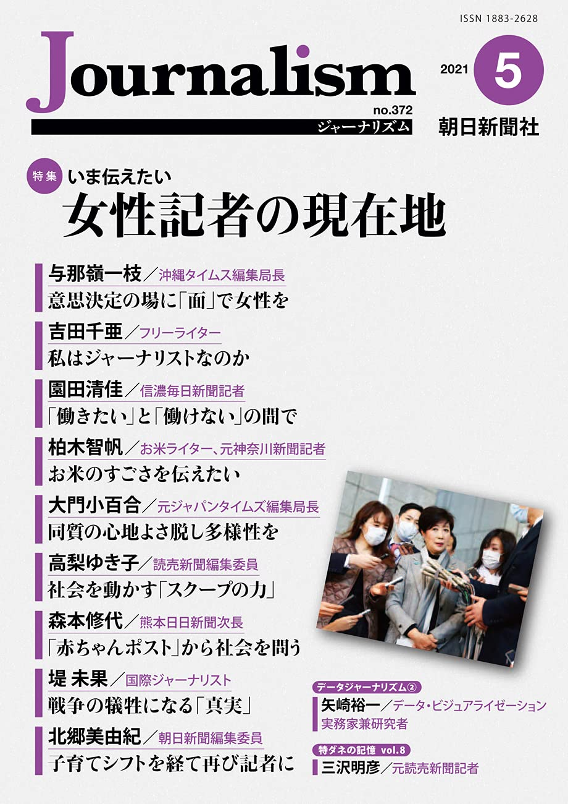

+++
author = "Yuichi Yazaki"
title = "データジャーナリズム　その２　事例と手法から"
slug = "asahi-journalism-2021-2"
date = "2021-05-10"
description = ""
categories = [
    "data-journalism"
]
tags = [
    "",
]
image = "images/asahi-journalism-2021-2.jpg"
+++

※本記事は朝日新聞社ジャーナリスト学校による「Journalism(ジャーナリズム)  2021年5月号」に掲載された著者自身による記事の転載です。
Journalismは残念ながら現在休刊中ですが、[Amazonなどでバックナンバーを入手することができます](https://amzn.to/41lhX0y)ので、機会があればぜひお手にとってください。

# 読者と視聴者の利益のために直感的なビジュアルを目指そう

　前回の「[データジャーナリズム①定義と歴史を概観する](https://visualizing.jp/asahi-journalism-2021-1/)」に続き、今回は具体的な事例と手法などを紹介する。また、そのプロセス（制作過程）とプレゼンテーション（見せ方）も考察したい。まずは、昨年のシグマ・アワードでの入賞作品をはじめとする事例を紹介する。

## 具体的な事例の紹介

### 大気汚染の可視化

- See How the Worldʼs Most Polluted Air Compares With Your Cityʼs - The New York Times
	- https://www.nytimes.com/interactive/2019/12/02/climate/air-pollution-compare-ar-ul.html

　各都市における大気汚染の度合いを、ＰＭ２・５に見立てたドットや世界地図の上空を行き来する空気の流れ、都市ごとの棒グラフなどで可視化している （下）。棒グラフではインドのデリーがチャートの掲載範囲を大きく超える形で描かれており、その汚染のひどさを強調している。デリーや北京と自分が住む都市との比較ができるようにもなっている。提供されている公式アプリ内のＡＲ（拡張現実）ヴァージョンの記事では、スマートフォンを通じて眺める周囲の景色にＰＭ２・５を表すドットが漂い、その都市における数値の大きさを実風景にオーバーレイする形で確認することができる。

### スマホの健康負荷の喚起

- Why your smartphone is causing you ʻtextneckʼ syndrome
	- https://multimedia.scmp.com/lifestyle/article/2183329/text-neck/

　スマートフォンを利用する際に首を曲げている角度や時間によっては、首に20～30㎏前後の負荷を与えている。これが健康に悪影響を与える危険性を訴えるコンテンツ。写真や動画上に直接、「アノテーション」と呼ばれる解説を付け足して説明している （左） 。イラスト、写真、チャートなど様々な表現を同時に使用しながら、読者・視聴者の食わず嫌いを避け、わかりやすく伝達されるようページ全体に工夫がなされている。

### プライバシーポリシーの可視化
- Polisis
	- https://pribot.org/polisis
	- https://pribot.org/polisis/?_id=5b03d2276ff131496ccf099c&company_url=https%3A%2F%2Fwww.facebook.com&category=first-party-collection-use

　様々なサービスを利用する際、プライバシーポリシー（個人情報に関する指針）に同意が求められるが、長文で読みづらく、まともに読解しようとすれば大変な苦労をする。しかしこの中にエンドユーザーにとって一方的に不利益な条文があるかもしれないし、ポリシーの改定時にそういった内容がひっそり追加される可能性もある。Polisisというツールを利用すると、プライバシーポリシーにおいて「どんなデータ」を「どういった目的で取得する」のか、サードパーティ（利用サービスから第三者の関係にあるサービス）へデータの共有がなされているかどうか、などが明確となる。たとえばFacebookでは、２０２０年12月16日時点でこのような状態になっていた （下） 。マウスカーソルを乗せると該当部分のポリシーが文章で参照できる。

### 偽フォロワー数の解析
- Bytes and Pieces - Influencer: Instagram-Starsschummeln mit falschen Zahlen-Radio SRFVirus – SRF
	- https://www.srf.ch/radio-srf-virus/bytes-and-pieces-influencer-instagram-stars-schummeln-mit-falschen-zahlen

　Instagramのインフルエンサーのフォロワー数は大きな影響力を持つとされ、企業は広告効果を期待して宣伝を依頼する。そのフォロワーのうち、いわゆるボット（コンピューターで生成したアカウント）がどのくらい占めているのかを、機械学習の「決 けっ定 てい木 ぎ 」という手法で推定した。記事ではスイスのインフルエンサーのうち、ほぼ３分の１のフォロワーはフェイクだとして、直接本人に問うている動画 （上） も掲載されている。

## プロセスとしての手法

　次にデータを解析するプロセスから代表的な手法を七つ紹介していく。

### ①データのデジタル化

　紙でのみ存在するデータをデジタル化するには膨大な手間がかかる。人力で行おうとすれば、時間だけでなく費用も膨大にかかる。たとえば政治資金収支報告書。紙をスキャンしたデータがインターネット上で公表されているが、これを人力でデジタルデータにしようとすると人件費だけで１年分でも２０００万円前後はかかった例もある。だが、ＡＩを活用することで安価に実現できる可能性がある。従来のＯＣＲに加えて、手書き文字の判別や、写真や動画に誰が写っているかを特定する手法を複数組み合わせて、デジタル化ができるのだ。
　近年新たに公表されたケネディ大統領暗殺事件にまつわるＣＩＡ調査に関する資料、これらは３万４千ページ超に及ぶ紙文書や画像をスキャンしたものである。マイクロソフト社では自社ＡＩ製品のパフォーマンス宣伝を兼ねて、この資料をすべてデジタル化し、人物名でタグ付けを行い、ネット上で検索できる状態で公開している （注１）。
　また、リークされたいわゆるパナマ文書の解析にあたったＩＣＩＪ（国際調査報道ジャーナリスト連合）では、自分たちでデジタル化のためのツールを開発し、無料かつオープンソースで公開している。残念ながら現時点では英語、スペイン語、フランス語、ドイツ語のみの対応となるが、ＰＤＦ、画像、テキスト、スプレッドシート、スライドなど様々な形式のファイルをデジタル化し、人、組織、場所ごとに自動的にタグづけを行う （注２）。こうして作成した加工済データは、民間企業のクラウドサービスを経由せずに、国を超えたプロジェクトメンバーであるジャーナリストたちで共有されている。一般向けデータベースとしてはパナマ文書に続いたパラダイス文書などを含めて「オフショア・リークス・データベース」として公開されている （注３）。

### ②異なるデータの名寄せ

　別々に存在している二つのデータを結合することで新しい事実を発見する手法。ここでは、教師なし機械学習と統計モデリングを使用して、固定資産税の回避実態を明らかにした例を挙げる。
　米国テキサス州の住宅所有者は個人またはカップルにつき一つの住宅のみを免税対象にできるが、AirBnBとして自宅を貸し出している「短期賃貸」は免税対象とならない。だが、複数の不動産を所有し、AirBnBで貸し出す利用実態があるにもかかわらず税金免除を申請している個人またはカップルを、この手法により特定することができた。ある地域での「短期賃貸」申請データと電力会社の加入者データの名寄せを行い解析した （注４） 。通常はExcelでいうところのVLOOKUPと呼ばれる操作により実行するが、住所や氏名の表記が人によってマチマチである場合はうまくいかない。これを機械学習によって実行することで、人力に比べて大幅に省力化できた。この手法はほかへも応用が利きそうだ。

### ③住所と緯度経度の特定

　住所のみが含まれ、緯度経度が含まれていないデータが多くある。一般的な地図アプリでは、そのままでは描画することはできない。最低限、緯度経度が必要だ。住所から緯度経度を算出することをジオコーディングと言うが、Yahoo!JAPANのジオコーディングAPIは利用使途が限定されており使いづらい。以下のサービスが使いやすいだろう。

- 東京大学空間情報科学研究センター「ＣＳＶアドレスマッチングサービス」
	- https://newspat.csis.u-tokyo.ac.jp/geocode-cgi/geocode.cgi?action=start・OpenCage
- Geocoder API
	- https://opencagedata.com/

### ④写真からの住所の特定

　ある写真がどこで撮影されたのかを特定したい場合、その写真に写り込んだ景色とGoogleマップの衛星写真表示を組み合わせて、一点透視図法を用いて特定していく手法がある。写真がどこで撮影されたのかを、調査に生かすことが可能だ。

### ⑤センサーの活用

　スマートフォンや、安価なコンピューター端末であるラズベリーパイやArduino、ドローンといったデバイスを用いてセンサーデータを取得し、活用する手法だ。画像解析の手法が洗練されていった結果、カメラをセンサーとして利用することもできる。外部マイクをつけたスマホを森林に多数設置し、音を機械学習で聞き分けて不法伐採を監視するサービスがある。

### ⑥データ・クレンジング

　資料を機械が読み取れる状態にすることを指す。紙に出力された文章はＯＣＲで文字起こしするが、この延長でＰＤＦや紙でしか存在しない表データをデジタルデータ化することや、分析や可視化のために最低限必要となる「整然データ」（Tidy data）化することを指す。Excelで手動で行うことも可能だが、クレンジング手順自体の透明性や効率化のために、専用ツールを用いる方が望ましい。

### ⑦仮説の発見

　取得したデータそのものから仮説を発見するというアプローチがある。未知のデータに何が含まれているかわからない時点での仮説は、データを探索することによって、思い込みだったとして否定されることもある。主にマーケティングに用いられる「ＢＩツール」と呼ばれるジャンルのツールが、実は自由度が高くデータ内を探索するのにふさわしい。ただ、地図や文章（自然言語）に関してはこの限りではない。無償のものと有償のものとあるので、各ツール（Tableau／Power BI／QGIS／KH Coderな ど ）を検索してみていただきたい。

## プレゼンテーションとしての手法

　以上、データを解析するプロセスから見た手法を紹介してきたが、続いてプレゼンテーション、つまり「見せ方」から代表的な手法を紹介していく。

### ①インフォグラフィック

　数年前であればラトビアのInfogr.amというサービスが日本の報道機関で利用されていたが、最近ではイギリスのFlourishがよく使用されている。近年人気のBar Chart Raceがアニメーションで手軽に作れるほか、チャートの種類の豊富さ、モバイル対応などから人気のツールである。

- Flourish | Data Visualization & Storytelling
	- https://flourish.studio/

### ②フォトグラメトリ

　日本の放送局の報道においても、事件や事故現場の様子をＣＧで再現することはよくあるが、ＣＧとリアル映像はあくまで別々のものとして扱われる。ニューヨーク・タイムズが最近よく使うこの手法では、制作したＣＧを用いるまでは同じだが、ＣＧ空間内でカメラ位置を自由に移動させて、現場に居合わせた一般人や記者が撮影した写真や動画をＣＧ空間とシームレスにつなぎ合わせる。この手法によって現場の様子を、できるだけ精緻に再現しようとするのである。ニューヨーク・タイムズの記事 （注５）では、ガザ地区での抗議活動の際に、ボランティアが射殺された事件を取り上げており、現場に居合わせた人たちのスマホの画像や動画データを収集し、時系列に沿ってその場所へマッピング。三角測量を用いて、射撃場所を特定した。

③ストーリーボード

報道はノンフィクションであり、テーマや素材の取捨選択とその並び順、という構成によってクリエーティビティを発揮するといえる。構成されたテキストによるストーリーを補足するために画像やインタラクティブコンテンツ、動画が用いられる。ウェブページであればスクロールやページングによって、コンテンツが丸々、動画であれば動画再生によって時間軸を構成していく。
　この検討、つまりテーマや素材の取捨選択とその並び順の検討のために、コンテンツを静止画として紙に出力して俯瞰的にプレゼンテーションの手段を考えることを、ストーリーボードと呼ぶ。ストーリーボード自体は中間成果物で外部に公表はしない。最近ではストーリーボードをクラウドで行う、たとえばFigmaというクラウドで共有と共同作業が可能なデザインツールを用いた検討などが考えられる （注６） 。場所を問わずに参加が可能なことと、検討内容自体をデジタルで保存しておくことが可能である。

### ④解説動画

　ニュース解説メディア「Ｖｏｘ」やニューヨーク・タイムズによる事例が有名だが、動画による解説をExplainerVideo （解説動画）と呼ぶ （注７） 。解説動画は、イラストを用いたものとそうでないものに大別でき、前者については制作のためのツールや原理原則が存在する。後者は内容に合わせてその都度制作するため、英語圏でも制作のための明解な教材はない。ツールのイノベーションはあまりなく、アドビ社のPremiereやAfterEffectsで制作する。

### ⑤インタラクティブコンテンツ

　最近はブラウザ上でインタラクティブに操作できるコンテンツが増加している。インタラクティブな操作が可能ということは動的に見せられて魅力的であるだけでなく、デリバリーの仕方が根本的に変わる。二通りに分けて見てみよう。制作者側（作る人）が意図した順番でのみコンテンツ消費が可能な伝達の仕方、つまり従来のテキストコンテンツに近い届け方である「表現と伝達型」と、読者・視聴者（見る人）に大幅に自由度を与え、自身でデータを探索する自由さを与える「課題の探索型」だ。さらにはこれら二つを組み合わせる手法もある。
　読者・視聴者にとっての自由度の調整は制作者側にとって難しい。特集記事部門でピュリツァー賞を受けたニューヨーク・タイムズのSnow Fallというコンテンツ制作に携わったグレゴア・アイシュ氏は、Snow Fallのようなアクセス数を集めたコンテンツであっても、インタラクションの後ろに隠された情報はユーザーの85％に見られることなくスルーされた、という衝撃的な結果を講演で明らかにした。近年ではスクローリーテリングと呼ばれる手法を用いることも増えたが、これはブラウザのスクロールに合わせて、コンテンツの表示・非表示や再生・停止をコントロールし、読者・視聴者に操作の負荷を与えない手法である。

## 作り手にとってのメリット

　これまで定義、経緯、事例、手法と述べてきた。これらの未知のデータジャーナリズムの手法を学んでまで、記者が挑戦する意味はどこにあるのだろうか。通常の記事コンテンツと比較した際の特徴を以下に挙げる。

### ＰＶが多く、滞在時間も長い

　ワシントン・ポストが14の新設ポジションを設け、グラフィックとデザインチームの拡大を行っている。これは同社サイトのうち最も訪問された七つの記事のうち六つはグラフィックスを用いたものであり、最も訪問された記事「コロナウイルスシミュレーター」が２位の３倍以上だったことを受けての決定だ。
　ブルームバーグでは、２０１８年にグラフィックスチームが獲得した平均月間トラフィックは、前年比で19・３％増加したという。「我々は、グラフィックが与えた影響力を成功の物差しにしたいと考えている」と担当エグゼクティブディレクターを務めるマーチン・キオハン氏は述べている。

### 時間や費用の削減

　大量に存在する資料の中から、調査すべき資料を絞り込む。たとえば全体が数百万あるファイルの中から調査すべき数千ファイルへ絞り込むことができるだけでも人件費、ひいては費用面での効率化が図れる。前述のように、アナログで存在する資料をデジタル化する手法はＡＩによって大きく前進した。

### 新たな記録手法の開拓

　ユネスコの地球科学プログラムでは自然災害における「ハザード」（現象）と「ディザスター」（災害）を区別する。前者は自然災害の現象そのもので、後者は社会や経済が受ける影響や結果を指す。報道において、前者は写真や映像として断片的に記録されるが、後者の記録については確固たる方法論が存在しなかった。そのためデータ可視化の理論や事例を援用しながら、世界各地に点在する報道機関の現場においてそのあり方自体のトライ・アンド・エラーが日々行われており、現在進行形で国を超えて相互に刺激しあいながら洗練が進んでいる渦中にあるといえる。これについては災害報道以外でも同様で、データジャーナリズムが扱う大部分のテーマは社会科学と呼べるものであり、社会科学のデータ可視化は、目の前に即物的に視認することのできないテーマにまつわるデータを可視化することの難しさがある。

## 受け手にとってのメリット

　では、読者・視聴者にとってのメリットは何だろうか。筆者がデータ可視化実務家として、また、デザイナーとして経験してきた観点から２点挙げたい。

### 認知負荷の軽減

　行動経済学者として有名なダニエル・カーネマン氏が提唱する、人間の思考モードをシステム１と２に分ける考え方がある。システム１とは直感的かつ自動的に行われる速い判断を指し、システム２とは計算などしながらじっくりと行われる論理的な判断を指す。個々人の文章を読むことに対する慣れやコンテンツによるところも大きいと思うが、長文で書かれたテキストを読み込み、内容を理解するという思考活動は、システム２に近いのではないだろうか。そしてこの伝達の仕方は作り手が図らずも読者を選んでしまう。プレゼンテーションにコンピューターを用いて、インフォグラフィックスと呼ばれる静止画による図解、データ可視化と呼ばれる操作可能なチャートや地図、動画によるストーリーテリングはいずれもシステム１に近い活動である。近くないとしたら作品の完成度の問題であるといえよう。作り手としてはどちらか一方ではなく、まずはシステム１に対して視覚的に広く訴求をし、さらに詳しく知りたい読者・視聴者にシステム２に対応した、思いの丈を記した文章へいざなう、という方法は検討できないだろうか。
　スマートフォンが主戦場である以上、報道以外のジャンルであっても可処分時間を奪い合う競合となり、まずは負荷が少ないシステム１へ訴求することは思いのほか大事で、読者・視聴者にとっても意味のあることと考える。

### 自分ゴトに引き寄せられる

　インタラクティブなチャートや地図によるプレゼンテーションは、読者・視聴者の興味・関心を誘発する。そして実際に操作をしてみる中で自分に関係することが出てきたら、より興味・関心を持つようになるはずである。データから全体の傾向とその中での自分の立ち位置が見えたり、クイズ形式で自分の知識が試されたり、自分の政治的志向が何にあたるのか、言語化できていなかったものを言語化できたり……。そうやって世の中の出来事と自分の接点を見いだすことは、読者・視聴者にとって喜びとなる。一般の人々は天から下を、全体を見下ろすような視点で世の中を眺めておらず、それぞれが職業や人生経験に基づいた固有の立ち位置から眺めている。そんな読者・視聴者に社会的な出来事との接点を提供することができれば、ジャーナリストにとっても喜びにつながるのではないだろうか。

## 誰でもデータジャーナリスト

　データジャーナリズムのヴァージョン３・０の初期、イギリスのガーディアン紙でデータブログをはじめたサイモン・ロジャース氏は、現在Googleに所属し、国際的なコミュニティを牽引する大きな存在の一人である。２０２０年に開催した無料のＭ ム ー ク ＯＯＣ教材の中で彼は「誰でもデータジャーナリスト」と述べている。オープンなデータがあちこちに存在し、無料ツールがいくつも登場している。あとはやるだけだ、と。
　記者をはじめとする皆さんには、まずは自身がこれまで興味をもって継続的に取材してきたことをテーマに、コンピューターを用いるとどんな可能性が広がるのか、本稿も参考に思いを馳せていただきたい。一人で始めれば気楽だし、別な専門性を持つ複数人で取り組めば発見が多いはずだ。

## リンク

- JFK Files - Microsoft AI Lab
	- https://www.microsoft.com/en-us/ai/ai-lab-jfk-files
- Datashare | Visualizing.JP
	- https://visualizing.jp/datashare/
- ICIJ Offshore Leaks Database
	- https://offshoreleaks.icij.org/
- Artificial Informer - Dissecting a MachineLearning Powered Investigation
	- https://artificialinformer.com/issue-one/dissecting-a-machine-learning-powered-investigation.html
- How Times Reporters Froze a Fatal Momenton a Protest Field in Gaza - The New YorkTimes
	- https://www.nytimes.com/2018/12/30/reader-center/gaza-medic-israel-shooting-video-investigation.html
- https://www.figma.com/
- https://www.youtube.com/c/Vox/featured
