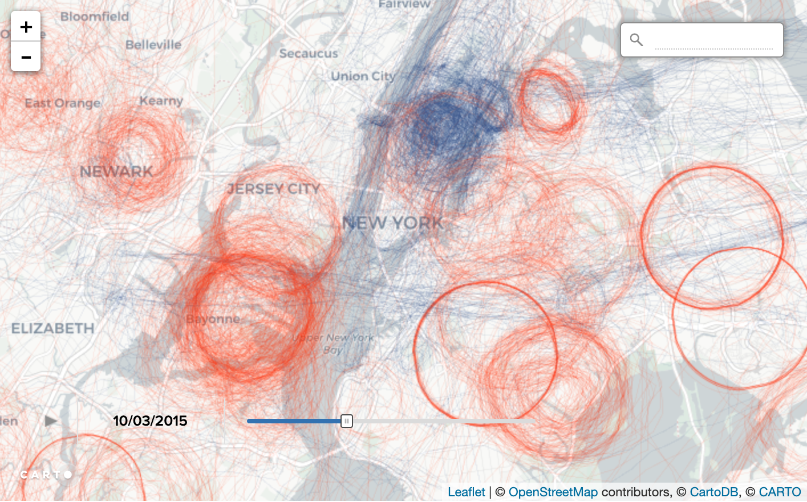

+++
author = "Yuichi Yazaki"
title = "全飛行機の飛行情報からスパイ機を特定したBuzzFeedのデータジャーナリズム"
slug = "buzzfeed-spyfly"
date = "2020-05-20"
categories = [
    "data-journalism"
]
tags = [
    "",
]
image = "images/BuzzFeed_SpyFly.png"
+++

[BuzzFeed Newsが報じた2016年の記事](https://www.buzzfeednews.com/article/peteraldhous/spies-in-the-skies)で、アメリカ連邦政府機関のFBIやDHSが、スパイ目的で飛行させていた約200機の連邦航空機の機種を特定し、飛行追跡ウェブサイトFlightradar24が収集している航空機の位置情報データから、対象機種のみを絞り込み、地図に可視化してみたところ、スパイ飛行している機体の飛行パターンがはっきりわかったと報じました。

<figure>

<figcaption>

左の画像は容疑者の後を追っていると思われる飛行機、右の画像は旋回を繰り返しているところ。[https://www.buzzfeednews.com/article/peteraldhous/spies-in-the-skies](https://www.buzzfeednews.com/article/peteraldhous/spies-in-the-skies) より引用。

</figcaption>

</figure>

特徴としては、以下があげられるとのこと。

- （週末を除く）平日のみ、数十機の米政府専用機がアメリカの都市の上空をゆっくりと旋回している。
- ほとんどの飛行機は小型で、地上1マイル（1.6km）ほどの高さを飛行しており、多くの飛行機はエンジンの音を消すために排気マフラーを使用しているため、スパイをしていることはわかりづらい。
- FBIとDHS（国土安全保障省）の捜査官が操縦するこの飛行機には、高解像度のビデオカメラが搭載され、多くの場合「拡張現実」ソフトウェアを使って、通りや会社名から個人の家の所有者まで、あらゆるものを映像に重ね合わせることができた。
- 少なくとも数機の飛行機には、下にいる人の携帯電話を追跡できる装置が搭載されていた。

たとえば2015年12月にカリフォルニア州サンバーナーディーノで起きた大量銃乱射事件。それまでそのエリアで飛行機が周回することはなかったのですが、テロ事件の後、90分以内に、2機の飛行機（1機はFBIのセスナ機、もう1機はDHSの偵察機）が現場を旋回していました。

FBIはBuzzFeed Newsの取材に対して、人種、民族、宗教に基づいて捜査を開始することは出来ないと語ったが、飛行機の飛行パターンをみていると、犯罪容疑者個人ではなく、特定宗教の人口が多い他の地域の上空を旋回する機体もあったことがわかりました。

それらの航路を地図上に示し、旋回の様子が明らかになりました。

<figure>

<figcaption>

[https://www.buzzfeednews.com/article/peteraldhous/spies-in-the-skies](https://www.buzzfeednews.com/article/peteraldhous/spies-in-the-skies) より引用。

</figcaption>

</figure>

### 機種が不明なスパイ機をランダムウォークで特定

調査報道はこれだけでは終わらない。[後追い記事も公開しています](https://www.buzzfeednews.com/article/peteraldhous/hidden-spy-planes)。そこでは既知のスパイ機だけでなく、正体を隠すために架空の会社に登録していた飛行機があることもわかったため、既知の飛行何千もの飛行パターンを用意。飛行特性を記述するために、旋回率、飛行した速度と高度、各飛行経路の周りに描かれた長方形の面積、飛行の持続時間、航空機メーカーや機種、航空機のトランスポンダから発せられる4桁のscoawkコードの情報までを用意しました。

「ランダムフォレスト」と呼ばれるアルゴリズムを用いて、これまでに同定された「100機近くのFBIとDHSの飛行機」と「500機の無作為に選ばれた飛行機」の2つのグループの特徴を区別するため、モデルのトレーニングを行いました。そのモデルを使って、全ての飛行機を評価し、各飛行機がFBIとDHSによって飛行された飛行機と一致する確率を算出したとのことです。

<figure>

<figcaption>

[https://www.buzzfeednews.com/article/peteraldhous/hidden-spy-planes](https://www.buzzfeednews.com/article/peteraldhous/hidden-spy-planes) より引用。

</figcaption>

</figure>

[リンク先の記事](https://www.buzzfeednews.com/article/peteraldhous/hidden-spy-planes)に、そこでわかった中で最も興味をそそられる5つの事例が紹介されています。
