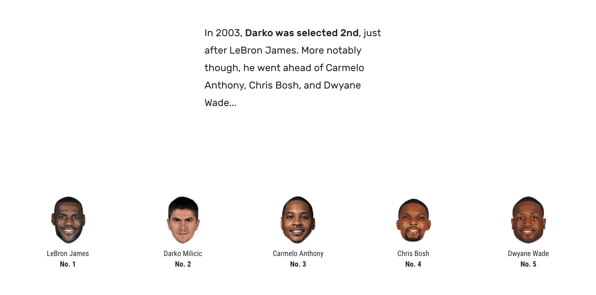

+++
author = "Yuichi Yazaki"
title = "データ・ジャーナリズムにおけるデータ・ストーリー 四類型"
slug = "data-story-4-types"
date = "2020-10-02"
categories = [
    "data-journalism"
]
tags = [
    "",
]
image = "images/NYT_SnowFall.png"
+++

[The Pudding](https://pudding.cool/ "https://pudding.cool/")というメディアのJan Diehmさんがデータジャーナリズムの講義（Data Journalism and Visualization with Free Tools）にて、どのようなタイプのデータ・ストーリーが存在するかとして、大きく以下の四つに分類し紹介していました。初見の分類法でしたのでこちらでも紹介します。説明文には筆者（矢崎）独自の観点や補足も付けています。ピックアップされている事例は元の講義に準じます。

- Scrollytelling(スクローリーテリング)
- Microstories (マイクロストーリーズ)
- Non-traditional (非伝統的)
- Explainers (説明者)

## Scrollytelling(スクローリーテリング)

閲覧者がページを下にスクロールすると、アニメーションとともにストーリーが直線的に展開する手法。閲覧者はただスクロールするだけでよく、クリックやホバーを含む込み入った操作をする必要がありません。PCのみならずスマホやタブレットでの親和性も良いですね。

元々この手法を用いた開拓者たるコンテンツは[ニューヨーク・タイムズのSnow Fall](https://www.nytimes.com/projects/2012/snow-fall/index.html#/?part=tunnel-creek "https://www.nytimes.com/projects/2012/snow-fall/index.html#/?part=tunnel-creek")という作品。パララックス・スクロールに動画をシームレスに組み合わせてデータ・ストーリーに応用した印象です。

パララックス・スクロール自体は、Snow Fall以前から、とくにiOSデバイスがFlashをサポートしなかったため、Flashがウェブで全面的に使えなくなって以降、主要でささやかな演出の一貫として、ウェブでの商品紹介ページなどでマーケティングの観点からよく利用されていた印象ですが、この手法のジャーナリズムへの転用といえそうです。

#### Snow Fall: The Avalanche at Tunnel Creek - Multimedia Feature - NYTimes.com

登場した際、驚きをもってシェアされたSnow Fall。もう8年前のコンテンツですね。元ニューヨーク・タイムズのデータ・エンジニアが「ユーザーの85%がインタラクティブなコンテンツをスルーする」と衝撃的なトークをカンファレンスで行ったこともありました。これは別記事にします。

<figure>

<figcaption>

[https://www.nytimes.com/projects/2012/snow-fall/index.html#/?part=tunnel-creek](https://www.nytimes.com/projects/2012/snow-fall/index.html#/?part=tunnel-creek)

</figcaption>

</figure>

#### Twenty years of the NBA redrafted

The Pudding 作のコンテンツです。The Pudding はこのようなジャーナリズムど真ん中よりも少しエンターテイメント寄りのコンテンツが多い印象です。

<figure>

<figcaption>

[https://pudding.cool/2017/03/redraft/](https://pudding.cool/2017/03/redraft/)

</figcaption>

</figure>

#### Going Gray

ロイターが日本の高齢化社会のことを他国との比較から注目しているコンテンツです。

<figure>

<figcaption>

[https://graphics.reuters.com/JAPAN-AGING/010091PB2LH/index.html](https://graphics.reuters.com/JAPAN-AGING/010091PB2LH/index.html)

</figcaption>

</figure>

## Microstories(マイクロストーリーズ)

Scrollytellingに比べるとアナログなアプローチで、焦点をかなり絞り、静止画の一枚で完結するようなデータ・ストーリーの伝え方です。

#### Mona Chalabi

Monaさんはニューヨーク在住のジャーナリストで、個人ワークをInstagram上で発表し続けています。

<figure>

https://www.instagram.com/p/BtTjIYwngqn/

<figcaption>

[https://www.instagram.com/p/BtTjIYwngqn/](https://www.instagram.com/p/BtTjIYwngqn/)

</figcaption>

</figure>

### Dear Data

MoMAのパーマネント・コレクションにも選出された、ロンドンとニューヨークに住む女性デザイナー同士のコラボレーションです。

<figure>

<figcaption>

[http://www.dear-data.com/](http://www.dear-data.com/)

</figcaption>

</figure>

## Non-traditional(非伝統的)

従来のデータ・ストーリーとはまったく異なり、従来のチャートやグラフは全く用いず、代わりに画像・動画・ARやVRなどの新しい技術を使用してデータ・ストーリーを伝えています。

#### Apollo 11: As They Shot It - The New York Times

ニューヨーク・タイムズによるApollo 11月面着陸五十周年を記念したコンテンツ。できるかぎり状況をリアリスティックを持った伝達のために、残された会話や写真を素材を再構成しています。スクローリーテリングの手法も用いていますがそれだけではないため、こちらの分類されているようです。

<figure>

<figcaption>

[https://www.nytimes.com/interactive/2019/07/18/science/apollo-11-as-they-shot-it-ul.html](https://www.nytimes.com/interactive/2019/07/18/science/apollo-11-as-they-shot-it-ul.html)

</figcaption>

</figure>

#### The NFL Has Had 280 Concussions This Season

チャートを一つも使用していませんが、これも「データ」を用いたデータ・ストーリーだとJanさんは紹介しています。

<figure>

<figcaption>

[https://vimeo.com/253738508](https://vimeo.com/253738508)

</figcaption>

</figure>

## Explainers(説明者)

物事の仕組みを詳細に説明するためにインタラクションやアニメーションが用いられているデータ・ストーリーです。

#### Parable of the Polygons - a playable post on the shape of society

筆者も大好きな、個人が考える多様性がコミュニティにどのようなインパクトがあるかを示したインタラクティブ・コンテンツです。

<figure>

<figcaption>

[https://ncase.me/polygons/](https://ncase.me/polygons/)

</figcaption>

</figure>

#### How To: Tune a Guitar

ジャーナリズムといえるか疑問ですが、実際にギターをチューニングをするためのインタラクティブ・コンテンツです。

<figure>

<figcaption>

[https://mathisonian.github.io/idyll/how-to-tune-a-guitar/](https://mathisonian.github.io/idyll/how-to-tune-a-guitar/)

</figcaption>

</figure>

#### Let's Learn About Waveforms

ジャーナリズムといえるか疑問ですが、波形についての The Pudding 作のインタラクティブ・コンテンツです。

<figure>

<figcaption>

[https://pudding.cool/2018/02/waveforms/](https://pudding.cool/2018/02/waveforms/)

</figcaption>

</figure>
