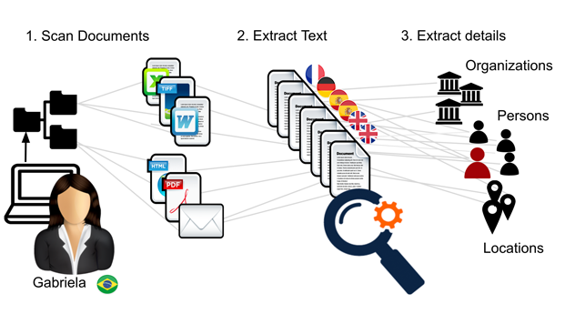
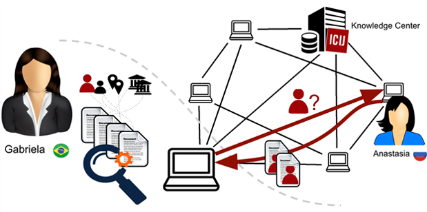

+++
author = "Yuichi Yazaki"
title = "調査報道のためのファイル探索アプリDatashare"
slug = "datashare"
date = "2019-10-12"
categories = [
    "data-journalism"
]
tags = [
    "オープンソース","データベース","自然言語処理"
]
image = "images/Datashare-topimage.png"
+++

[Datashare](https://datashare.icij.org/)は、非営利の国際調査ジャーナリストコンソーシアム（ICIJ）によって開発された無料のオープンソースデスクトップアプリケーションです。ジャーナリストが利用することが想定されています。

パナマペーパーやパラダイスペーパーなど、ICIJが最大のプロジェクトを実現するのに役立ったのと同じテクノロジーで構築されています。こんなことが行えるそうです。

<figure>

<figcaption>

[https://www.icij.org/blog/2018/05/icijs-datashare-project-will-help-journalists-breach-borders/](https://www.icij.org/blog/2018/05/icijs-datashare-project-will-help-journalists-breach-borders/)

</figcaption>

</figure>

- 潜在的なサードパーティの干渉からドキュメントを保護しながら、ローカルコンピューター上ですべてのドキュメントにワンストップにアクセスする
- **ファイルからテキストを抽出**（現在は英語、スペイン語、フランス語、ドイツ語に対応）することによって、PDF、画像、テキスト、スプレッドシート、スライドなど様々な形式のファイルを同時に検索
- **人、組織、場所ごとに自動的にタグづけ**し、検出およびフィルタリングが可能

「ファイルからテキストを抽出」や「人、組織、場所ごとに自動的にタグづけ」するところに、様々なアルゴリズムが用いられています。

機械可読テキスト化にはApache Tikaを使用、光学文字認識にはTesseract OCRを適用し、検索エンジンにはElasticsearchを使用しています。

<figure>

<figcaption>

[https://www.icij.org/blog/2018/05/icijs-datashare-project-will-help-journalists-breach-borders/](https://www.icij.org/blog/2018/05/icijs-datashare-project-will-help-journalists-breach-borders/)

</figcaption>

</figure>

また、分析のためにGoogleが制御するサーバーなどのサードパーティのプラットフォームにデータを送信しません。そうではなく、ICIJのナレッジセンターでホストしている以前のICIJ調査（パナマペーパーやパラダイスペーパーなど）からのすべての漏洩データとも接続できるとのことです。

Datashare開発者のJulien Martinさんは、「Datashareは作業の重複を回避するだけでなく、新しい探検の道を開き、多様な思考を促し、セキュリティとプライバシーを改善して、選択したジャーナリストが24時間年中無休で情報を入手できるようにします。」と述べています。

- https://datashare.icij.org/
- https://icij.gitbook.io/datashare/
- https://github.com/ICIJ/datashare
