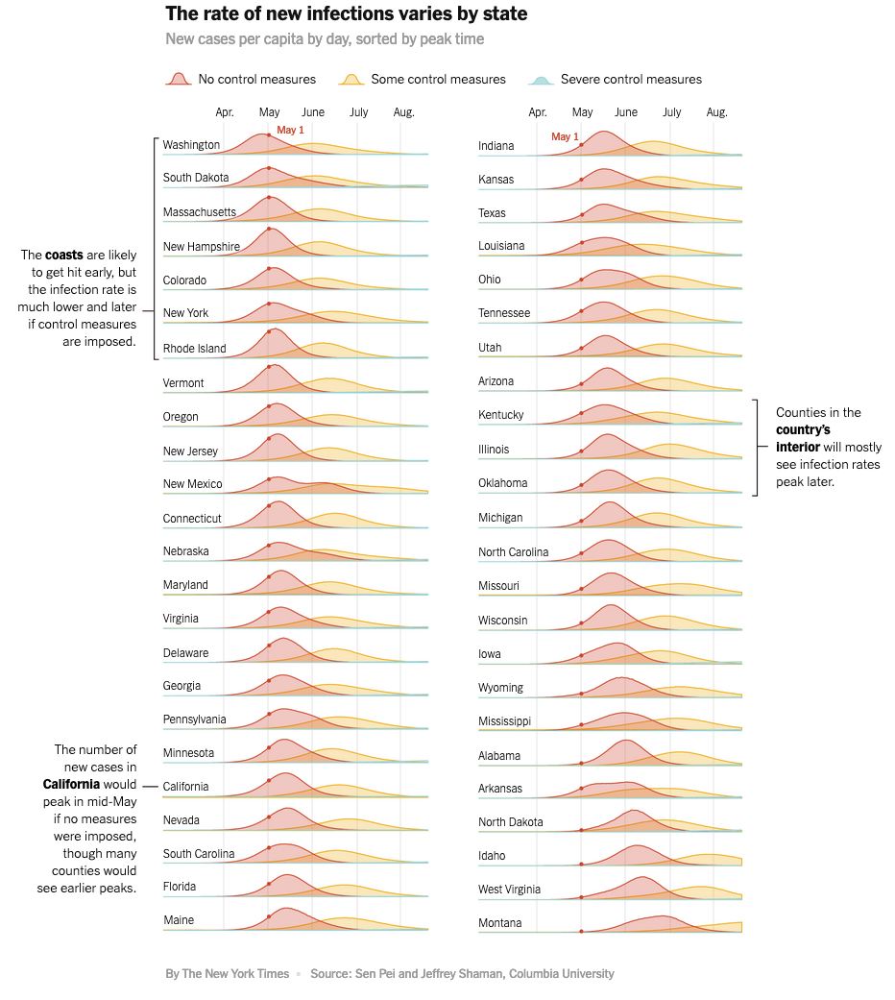
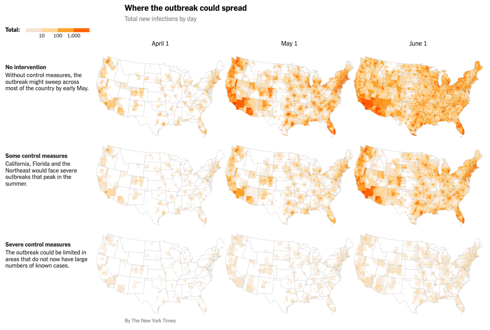

+++
author = "Yuichi Yazaki"
title = "緊急の管理措置なしには、北米でコロナウイルスの圧倒的な広がりが起こってしまう、とNew York Times紙"
slug = "nyt-corona-200320"
date = "2020-03-21"
categories = [
    "data-journalism"
]
tags = [
    "",
]
image = "images/nyt_colona_1.png"
+++

北米においてもコロナウイルスが広がりをみせています。

「コロナウイルスは、これまでの検査で示されているよりもはるかに多くの人々に感染しており、今後数ヶ月で病気や死の流れを大幅に食い止めるためには、まだ多くの症例を見ない国の一部での社会的接触を制限するための厳しい措置が必要だ」とNew York Timesの記事が伝えています。

[Coronavirus Could Overwhelm U.S. Without Urgent Action, Estimates Say](https://www.nytimes.com/interactive/2020/03/20/us/coronavirus-model-us-outbreak.html)

アウトブレイクがどのように広がるかについて、州による管理措置がどの程度取られるかによって、  
・管理措置なし  
・いくつかの管理措置  
・厳しい管理措置  
の3つのシナリオで、アウトブレイクの広がりを推測したチャートをNew York Timesが記事化しています。

・ニューヨークタイムズ\[既知の症例のデータベース\]  
・国勢調査局の輸送データ  
のデータを利用して、コロンビア大学の研究者が、モデル化しました。

前提として、州によって発生状況や管理措置の対応が異なる、ということがあります。

ニューヨーク市、シアトル、ボストン、およびカリフォルニアの一部ではすでに大規模なアウトブレイクが発生しており、カリフォルニア州、ニューヨーク州、イリノイ州では「厳しい管理措置」を実施しています。

一方他の州では管理措置に対する抵抗もみられているとのこと。多くの企業は、依然として労働者がオフィスに来ることを要求している、としています。

（とてもむずかしい注文である）国が感染率を半分に抑えることができたとしても、今後2か月で約65万人が感染する可能性がある、としています（北米での話です）。

そのことを示すために、[3つのシナリオで4月1日〜8月1日までの推測を地図で確認できるインタラクティブ・コンテンツが用意](https://www.nytimes.com/interactive/2020/03/20/us/coronavirus-model-us-outbreak.html)されています。

## 推論モデルの構築

コロンビア大学のSen Peiさんらがモデル構築しています。以下のように述べています。

>  私は高次元モデルデータ同化（M / D / A）フレームワークを採用しました。これは、新しいウイルスの伝播動態をより良く理解するために、私たちのグループが長年にわたって感染症の予測と推論に開発し使用してきた方法論です。  
>  人間の動きのデータを使用して、数学モデルを構築し、中国の375の都市と米国の3,000を超える郡の間でSARS-CoV-2の時空間的伝播をシミュレートしました。  
>  これらのモデルは、両国で報告された発生率データに合わせて調整され、主要な疫学的パラメーターが推定されました。  
>  その後、較正されたモデルを使用して、さまざまな規模での発生の進行を予測し、潜在的な介入の効果を評価しました。  
>  また、米国の主要な疫学的パラメーターを推測し、封じ込め対策の影響をテストし、インフルエンザ様疾患をリアルタイムで予測するために、米国CDCが率いる共同作業に参加しました。
> 
> [Sen Pei | Research](http://%20http//www.columbia.edu/~sp3449/covid-19.html) （翻訳は筆者）

>   New York Timesと共同で、米国でのSARS-CoV-2の広がりのシミュレーションに取り組んでいます。  
>   私は、米国本土でのCOVID-19発生の広がりと成長をシミュレートするために、郡レベルのスケールで適用されるメタポピュレーションモデルを開発しました。  
>   このモデルでは、2種類の動作-毎日の通勤とランダムな動作が考慮されました。  
>   昼間と夜間の伝送プロセスは別々にモデル化されました。  
>   私たちの予備的な結果は、通勤や場所間の移動の減少よりも、社会的距離が確認された症例の広がりと増加を大幅に遅らせることを示しています。
> 
> [Sen Pei | Research](http://%20http//www.columbia.edu/~sp3449/covid-19.html) （翻訳は筆者）

関連するコードやデータは[GitHub](https://github.com/SenPei-CU/)にあがっています。
