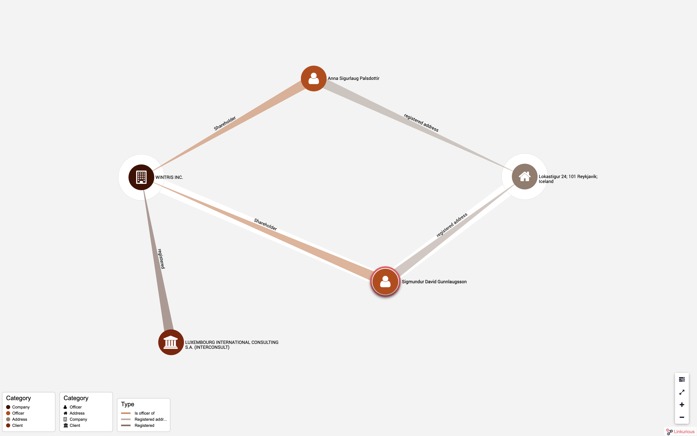

+++
author = "Yuichi Yazaki"
title = "パナマ文書におけるデータの構造化"
slug = "panama-papers-wrangling"
date = "2020-05-19"
categories = [
    "data-journalism"
]
tags = [
    ""
]
image = "images/160403-overview-01-2-1280x640.jpg"
+++

数年前、モサック・フォンセカというパナマの法律事務所から大量の機密文書が流出しました。タックスヘイブンなどでの企業設立支援を扱う法律事務所として有名だったことから調査報道に値するのではないかと「国際調査報道ジャーナリスト連合」（ICIJ）が流出文書を元に調査を主導、データのラングリングを行い、世界中100の報道機関の記者とコラボレーションを行いました。いわゆる「[パナマ文書](https://www.icij.org/investigations/panama-papers/)」として知られている調査報道です。

流出文書の全体的なファイルは、モサック・フォンセカが1977年から2015年の長い間に渡って作成・収集したほぼすべての文書、合計ファイルとしては2.6テラバイト、1,150万ファイル。ファイルの種類も多様で、スプレッドシート、電子メール、PDFからもはや使用されていない曖昧で古いフォーマットまで存在したとのこと。

データ量がビッグデータとも呼べるサイズで、構造やつながりを維持していない。この状態から如何に、調査報道を記者が行ったり、一般人が気軽にブラウズできる状態を作り上げたのでしょうか。

ICIJのメンバーでデータユニットのリーダーである[Mar Cabraがインタビューに応えて](https://www.icij.org/blog/2016/04/data-tech-team-icij/)明らかにしています。

モサック・フォンセカから流出した文書は、構造やつながりを維持しておらず、リバースエンジニアリングを行っていったとのこと。まずはOCR化、そしてデータベースに保存して検索できる状態にし、さらには関係のあるドキュメント同士を接続していきました。その作業にはオープンソースが役に立ったとのことです。

OCRといった文書処理にはApache TikaとTesseractを使用。データベース化する際のインデックス作成にはApache Solrを用い、そのユーザーインターフェイスとしてProject Blacklightを採用しました。ここまですべてオープンソース・ソフトウェア。

つながりを示すために、グラフデータ化したほうがよいだろうということで、SQLデータベースからETLソフトウェアTalendを用いて、Nep4Jデータベースへと変換し、データ可視化のために[Linkurious](https://linkurio.us/)という商用サービスを用いました。これを使うとグラフ構造のデータを、グラフ構造として表示することが可能になります。Linkuriousにはウィジェット機能が組み込まれているので、インタラクティブな状態でレポートへ組み込むことも出来ました。

こうして、データベースとして公開し、これを元に世界中のジャーナリストが調査報道を行いました。 約21万5000社と1万4153人がモサック・フォンセカの顧客となっていたことが明らかになりました。政治家、経営者、著名人などがタックスヘイブンを利用していることが明らかになり、アイスランドとパキスタンでは首相辞任。日本は439の企業や個人が明らかになり、日本の国税当局が調査を行い、所得税など総額31億円の申告漏れがあったと[朝日新聞が報じています](https://www.asahi.com/articles/ASK8R1T0CK8RUTIL002.html)。

単にOCRかけてデータベースに投入するだけでなく、ひと手間をかけて、通常のリレーショナルデータベースからグラフデータ化を行っていることも大きなポイントで、これで個々の企業や個人だけでなく、そのつながりにも注目することが可能となります。

<figure>

<figcaption>

[https://linkurio.us/blog/panama-papers-how-linkurious-enables-icij-to-investigate-the-massive-mossack-fonseca-leaks/](https://linkurio.us/blog/how-the-icij-used-linkurious-to-reveal-the-secrets-hidden-in-the-swiss-leaks-data/) より引用

</figcaption>

</figure>
