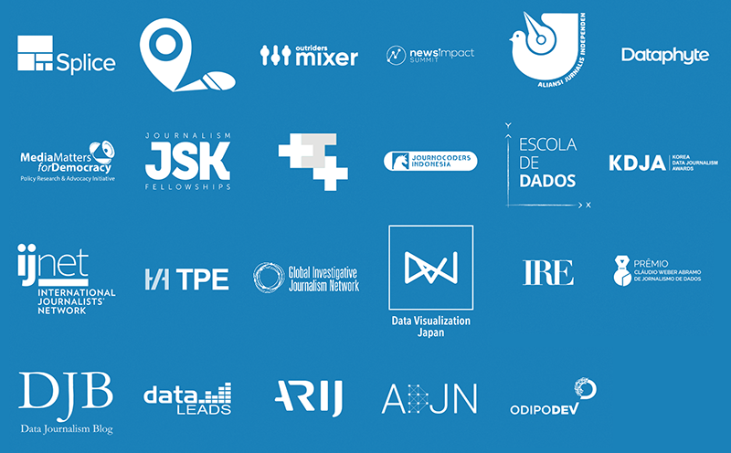

+++
author = "Yuichi Yazaki"
title = "シグマ・アワード 2021"
slug = "sigma-awards-2021"
date = "2021-01-26"
categories = [
    "data-journalism"
]
tags = [
    "",
]
image = "images/Sigmas-2021-promo-banner-twitterTFB1200x628.png"
+++

### データ・ジャーナリズムにおけるグローバル最大規模のアワード

#### シグマ・アワードって?

今年で通算十一年目になるシグマ・アワード、**エントリーを現在（2021年1月いっぱい）受付中**です。

シグマ・アワードは**「データジャーナリストのグローバルコミュニティに力を与え、高め、啓発することを目的とした新しいデータジャーナリズムコンテスト」**です。運営や審査には**第一線の研究者・実務家**がかかわり、**世界中からエントリーがなされる**アワードです。昨年（2020年）実績では、**66の国と地域、287の組織から510点の応募**があったとのことです。

#### 2021年、シグマ・アワード自身の考える重点項目

- COVID-19パンデミックに取り組む人々に焦点を当て、世界中で行われている最高のデータジャーナリズムにスポットライトを当てる。
- アワードを超えて永続するコミュニティ構築。
- 現代のジャーナリストが直面している真の緊急課題に取り組むウェビナー、チャット、オンラインリソースの収集をセットアップする。
- 世界中のデータジャーナリズムコミュニティを団結させ、活気づけ、拡大するための方法としてアワードを活用する。

#### 昨年度（2020年）との違い

- 5000米ドルの賞金が、受賞者の間で分配されます。分配の仕方は審査員が決定する予定。
- 作品エントリーする「カテゴリー」の廃止。報道機関（ニューズルーム）の所属人数よる分類のみ、カテゴリーとして残っています。

#### 応募に際してのルール

- 応応募作品は、2020年に発表された作品に限ります。
- 期日までに、公式オンラインフォームから提出してください。
- 応募者は何点でも応募することができます。
- 応募には、大規模ニューズルームか小規模ニューズルームか個人かを明記してください（小規模とは、ジャーナリスト（正規や下請けを含む）の数が35人以下の組織を指します）。複数組織によるコラボレーション作品の場合、大規模としてエントリーしてください。
- シグマ・アワードのウェブサイトやその他のマーケティング資料に、応募団体の名前やロゴを含め、応募作品の素材を使用する権利を与えることに同意します。
- 審査員は、作品を本質的なものに絞り込んだ、短く、簡潔で、よく練られたエントリーを評価します（冗長に長く書いても評価しないという意味だと思われます）。
- 将来的には、この賞のプログラムを言語にとらわれないものにすることを目標としています。2021年のコンテストは締め切りが厳しいため、英語以外の言語での応募は、できるだけ翻訳が必要となります。事前審査員と審査員があなたの作品を十分に理解できるように、できるだけ多くの翻訳をしてください。

#### こんな作品を待っています、とのこと

- ジャーナリズムのサービスとして、素晴らしいデータ収集と分析を行い、理想的には公共の関心に答える、まだ知られていない事実に光を当てること。
- 素晴らしいストーリーテリングとエンゲージメント、おそらく視覚的にも対話的にも。
- 記事のレポートや分析として、もしくは、コミュニティが自分たちで重要な情報を発見できるようにするという意味で、素晴らしい公共サービスであること。
- この分野を前進させるような素晴らしいアイデアを持っていること。

#### メディア・パートナー

各国にメディア・パートナー団体があります。日本では、Data Visualization Japanというコミュニティがここ数年取り組んでいます。

#### 追加情報

前回の受賞作品や過去の経緯などをスライドにとりまとめています。

#### 応募ページ

[エントリーページ](https://sigmaawards.org/apply)

#### ご不明点

日本語によるお問い合わせに対応します。Twitterで @yuichy02 もしくはメールで datavizjapan@gmail.com までご連絡ください。
