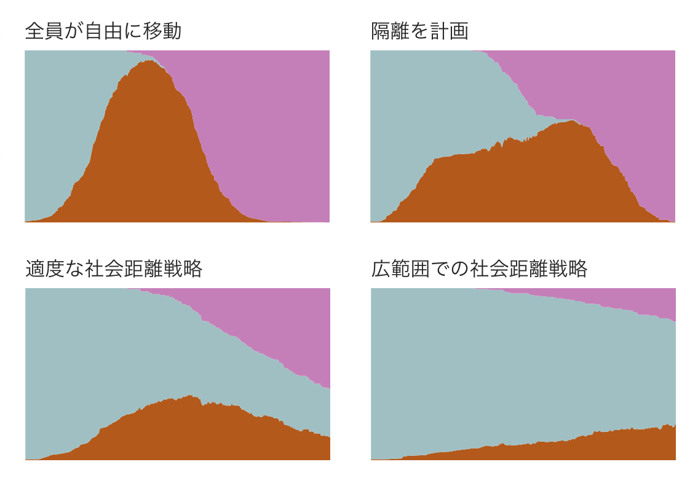

+++
author = "Yuichi Yazaki"
title = "ワシントン・ポストによる「曲線を平らにする」ための啓蒙記事の制作過程"
slug = "wp-corona-simulation"
date = "2020-06-20"
categories = [
    "data-journalism"
]
tags = [
    ""
]
image = "images/corona-simulation.png"
+++

日本でも大いに話題になった[ワシントン・ポストによる「曲線を平らにする」ための啓蒙記事](https://www.washingtonpost.com/graphics/2020/health/corona-simulation-japanese/)。主に制作過程について、まとめてみます。

- [https://www.washingtonpost.com/graphics/2020/health/corona-simulation-japanese/](https://www.washingtonpost.com/graphics/2020/health/corona-simulation-japanese/)

### 記事内容の紹介

記事の公開は3月中旬。

人口200人の町で、1人の感染者が現れたあと、ソーシャル・ディスタンシング（社会的距離）をどの程度とるかによって、事態がどのくらい変わってしまうのかをシミュレーションで示しています。

<video autoplay loop muted playsinline>
  <source src="images/corona-simulation.mp4" type="video/mp4">
  Your browser does not support the video tag.
</video>

https://www.washingtonpost.com/graphics/2020/health/corona-simulation-japanese/ より引用

数理モデルには基づいておらず、ランダム（プログラムよる乱数）に過ぎません。また悲観的なことを表現したくないという意図から、人が死ぬ（減る）表現は省略されています。

そのため、あくまでCovid-19ではなく、ニセの病気Simulitisをシミュレーションしたという体裁をとっています。

ソーシャル・ディスタンシングの取られ方で、4つのシミュレーションがなされています。

<figure>

<figcaption>

https://www.washingtonpost.com/graphics/2020/health/corona-simulation-japanese/ より引用

</figcaption>

</figure>

そして時系列での増減をエリアチャートでも示しています。このエリアチャートが、当時のキーフレーズだったFlattern The Curveをそのまま再現していたことから、キーフレーズの理解を促進したという側面もありました。

だから、SNS上での、家にいよう、ソーシャル・ディスタンシングが大事だという呼び掛けの際にリンクが添付されることが多く、ワシントン・ポストのメディア・レポーターPaul Farhiのツイートによると、同紙史上最も読まれた記事となったとのことです。作者はまだ同社入社半年のHarry Stevensさんでした。

### 制作過程

いくつかの記事から、制作過程を掘り起こしてみます。

- https://datajournalism.com/read/longreads/simulating-a-pandemic
- https://www.poynter.org/reporting-editing/2020/how-a-blockbuster-washington-post-story-made-social-distancing-easy-to-understand/

#### 1.プロトタイピング（3月上旬）

コロナウイルスの広がりを視覚化する方法を模索していたグラフィックチームにそのアイデアを持ってきました。そのときのコードは公開されています。

- [元々スタディしていたコード](http://bl.ocks.org/harrystevens/f59cf33cfe5ea05adec113c64daef59b)
- [プロトタイプとして提示したコード](https://bl.ocks.org/HarryStevens/e2f49170367bbc10644ecb81f0e6dc54)

#### 2.ジョンズホプキンス大学の研究者が作り上げた数理モデルを利用して可視化を検討したが諦めた

- ジョンズ・ホプキンス大学の准教授であるローレン・ガードナー（Lauren Gardner）さんの作成した複雑な数理モデルを可視化しようとしていたが、最終的には、複雑すぎてグラフィックによる説明は無理だと伝達。
- 実際のモデル計算を行うと、スーパーコンピュータで何時間も計算集中的な数学モデルを実行する必要があって一晩かかるようなものもあり、しかしそれでも、多くの不確実性が存在することを、ローレン彼に警告したとのこと。
- そこで彼は、数理モデルを再現する方向のアイデアを諦め、ボールがランダムに移動するというシンプルなアイデアにこだることにしたそうです。

#### 3.プロトタイピング

- 三回の変更を経て、完成版へたどり着いたとのことです。
- 一つ目のヴァージョンはユーザーのスクロールに合わせてテキストやグラフィックの塊が現れたり消えたりするストーリーテリングを使用していましたが、グラフィックが見づらくなっていました。
- 二つ目のヴァージョンは、ドットがSimulitisから回復しないようにしたもので、荒涼とした感染症の暴走を引き起こしました。
- ほぼ十数人の人々からのフィードバックを集めた後、40～50時間かけて記事を仕上げ、最終的な作品に着地しました。
- シミュレーションが仮想ウイルスで死ぬ人々を示していないのは、意図的に行ったとのことです。グラフィックチームは、すべてのドットが死んでいくことで不必要に暗い視覚化を望んでいませんでした。
- 画面上部のエリアチャートの方は、データ収集の精度が最も高いと判断して、ジョンズホプキンス大学のCOVID-19データセットを選択しました。

### 反響

- 電子メール、Facebook、Twitter、LinkedInを通じて受け取った何百ものメッセージに今も対応しており、多くの人が、可視化-社会的な距離感がどのように「曲線を平坦にする」ことができるかを見て、実際にコロナウイルスに対する不安を鎮めたと言っています。

- 読者が自発的に翻訳してから新聞がそれを校正してくれたおかげで、ストーリーは13か国語で利用できるようになったとのことです。

- オバマ前大統領は1億1400万人のフォロワーにこの話をツイートし、13万5000のリツイートを生み出しています（2020年6月20日現在）。

[XユーザーのBarack Obamaさん: 「Watch this. It shows why we should all do the right thing and stay home to the fullest extent possible. All of us can help slow the spread of the virus, protecting the elderly, the vulnerable, and each other.](https://twitter.com/BarackObama/status/1239267360739074048)

